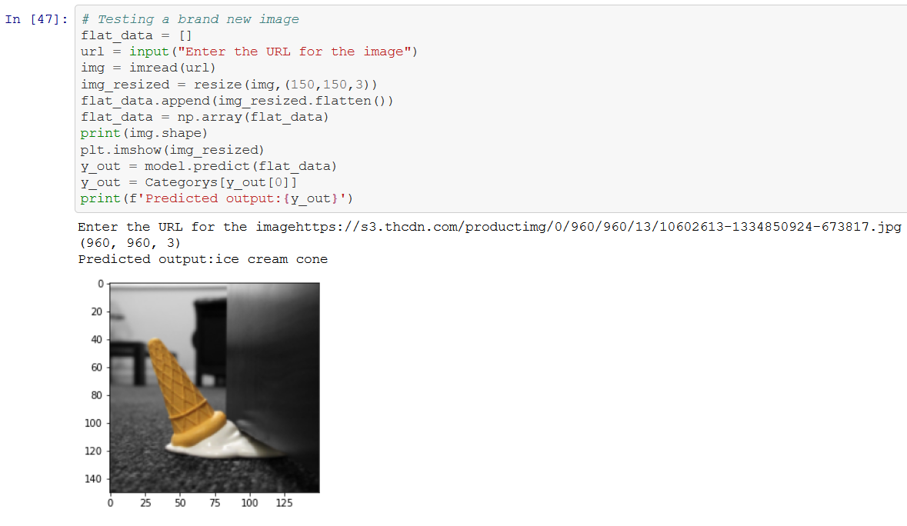

# Image classification using SVM

This repository contains the jupyter notebook and the dataset required to run the notebooks. Where I am performing Image classification using SVM(Support Vector Machine) and then predicting/classificating the images from the trained model.

Note that the Dataset used for training is created using Bing Image Downloader. So anyone trying to explore or make any hack try to run the lines in the jupyter notebook to have the dataset created.

